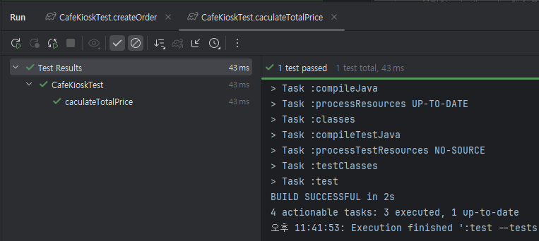

# TDD : Test Driven Development

생성자: 정환 박
생성 일시: 2025년 4월 21일 오후 11:18
최종 편집 일시: 2025년 4월 21일 오후 11:53

## Test Driven Development

- 프로덕션 코드보다 테스트  코드를 먼저 작성하여 테스트가 구현 과정을 주도하도록 하는 방법론
- RED, GREEN, REFACTOR 단계
- **RED**
    - 실패하는 테스트 작성
    - 일부러 틀리게 쓰라는 것이 아님 → 구현부 없이 테스트를 먼저 작성하므로 당연히 실패가 나옴.
- **GREEN**
    - 빠른 시간 내에 테스트를 통과할 수 있는 최소한의 구현부 코드를 작성.
    - 초록불을 보기 위해 구현이 엉터리여도 상관없다.
- **REFACTOR**
    - 구현한 코드를 테스트 통과를 유지하면서 개선해 나간다.

### 예제

### 1단계 : 실패 테스트(RED)

CafeKioskTest.java

```java
@Test
void caculateTotalPrice() {
    CafeKiosk kiosk = new CafeKiosk();
    Americano americano = new Americano();
    Latte latte = new Latte();

    kiosk.add(americano);
    kiosk.add(latte);

    int totalPrice = kiosk.calculateTotalPrice();
    assertThat(totalPrice).isEqualTo(8500);
}
```

CafeKiosk.java

```java
public class CafeKiosk {
	/*... 생략...*/
	
	//컴파일 에러를 피하기 위한 최소한의 메서드만 작성
	public int calculateTotalPrice() {
	    return 0;
	}
	
	
}

```

테스트 결과 ⇒ 실패


### 2단계 : 성공 테스트(GREEN)

**핵심은 빠른 시간 내에 최소한의 코드 작성으로 초록불을 띄운다!**

```java
public class CafeKiosk {
	/* ...생략... */
	
	public int calculateTotalPrice() {
      return 8500; //아메리카노 + 라떼 가격은 8500원이므로 8500을 리턴
  }
  
}
```

테스트 결과 ⇒ 성공


### 3단계 : 개선 테스트(REFACTOR)

**초록불을 유지하면서 코드를 개선해 나간다!**

```java
public class CafeKiosk {

	/* ...생략... */
	public int calculateTotalPrice() {
      int totalPrice = 0;
      //Beverages 목록을 순회하며 가격을 더해나가도록 수정
      for (Beverage beverage : beverages) {
          totalPrice += beverage.getPrice(); 
      }
      return totalPrice;
  }

}
```

테스트 결과 ⇒ 성공


여기서 반복문이 아니라 다른걸로 또 개선해보고 싶다면? ⇒ 수정 후에도 초록불이 떠야한다!

```java
public class CafeKiosk {

	/* ...생략... */
	public int calculateTotalPrice() {
      //기존에 for문을 Stream API로 변경!
      return beverages.stream()
              .mapToInt(Beverage::getPrice)
              .sum();
  }

}
```

테스트 결과 ⇒ 성공



**TDD의 가장 큰 핵심 가치는 무엇인가**

- 피드백
    - 내가 작성하는 코드에 대해서 자주, 빠르게 피드백 가능하다.

### 선 기능 구현, 후 테스트 작성의 경우

- 테스트 자체의 누락 가능성
- 특정 테스트 케이스만 검증할 가능성(해피 케이스만 작성)
    - 예제를 예시로, 구현을 먼저했다면, 0잔 혹은 음수의 주문 수량과 같은 예외 케이스가 누락될 수 있음.
- 잘못된 구현을 다소 늦게 발견할 가능성

### 선 테스트 작성, 후 기능 구현의 경우

- 복잡도가 낮은, 테스트 가능한 코드로 구현할 수 있게 한다.
    - 복잡도가 낮은 == 유연하고, 유지보수가 쉬운
    - ex) 예제에서 주문 생성시 운영 시간에 들어가 있는지 확인하는 로직의 경우
- 쉽게 발견하기 어려운 엣지(Edge) 케이스를 놓치지 않게 해준다.
- 구현에 대한 빠른 피드백을 받을 수 있다.
- 과감한 리팩토링이 가능해진다.

<aside>
💡

TDD는 관점의 변화를 가져온다.

테스트는 구현부 검증을 위한 **보조 수단** ➡️ 테스트와 **상호 작용하며 발전**하는 구현부

**클라이언트** 관점에서의 **피드백**을 주는 Test Driven

</aside>